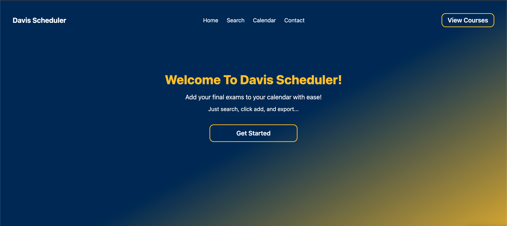

## Davis Scheduler
This solo project is a comprehensive exam scheduler designed for UC Davis CS students. It utilizes a MySQL database to store all exam-related information, a Next.js application to create a RESTful API for the backend, and a ReactJS frontend for intuitive user interaction. 

## Visit The Site
Feel free to check out the project [here](https://davis-scheduler.vercel.app)!

## Features
- **MySQL Database**: Stores detailed information about exams including date, time, course, location, and more.
- **Backend**: A combination of Prisma and Next.js provides robust RESTful APIs to manage exam data efficiently.
- **Frontend**: React allows for a user-friendly interface for viewing, adding, editing, and deleting exam information. The app is hosted on Vercel.

